# PanoramicData.Chunker - Architecture Diagrams

## Table of Contents
1. [High-Level System Architecture](#high-level-system-architecture)
2. [Multi-Tenant Data Architecture](#multi-tenant-data-architecture)
3. [Knowledge Graph Architecture](#knowledge-graph-architecture)
4. [Sequence Diagrams](#sequence-diagrams)
   - [Use Case 1: Help Query](#use-case-1-help-query)
   - [Use Case 2: SQL Query Assistance](#use-case-2-sql-query-assistance)
   - [Use Case 3: OData Query Assistance](#use-case-3-odata-query-assistance)
5. [Component Interaction Diagrams](#component-interaction-diagrams)

---

## High-Level System Architecture

### Overview Diagram

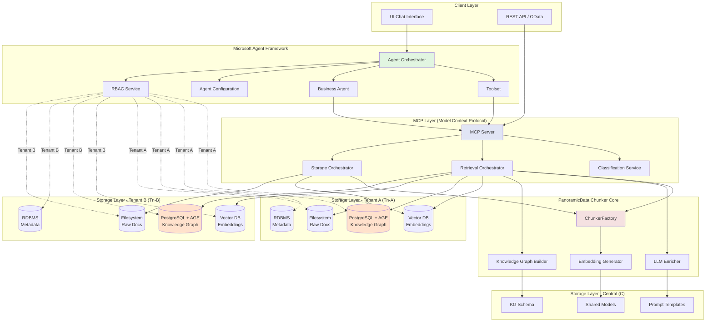

---

## Multi-Tenant Data Architecture

### Tenant Isolation Model

```mermaid
graph TB
    subgraph "Tenant Routing Layer"
   Router[Tenant Router<br/>X-Tenant-ID Header]
    TenantSvc[Tenant Service]
    end
    
    subgraph "Central Resources (Shared)"
        C_Models[Embedding Models<br/>GPT-4, etc.]
        C_Schema[KG Ontology<br/>Entity/Relationship Types]
        C_Prompts[Prompt Library<br/>Templates]
        C_TokenCounter[Token Counters<br/>OpenAI, Claude]
    end
    
    subgraph "Tenant A Data Partition"
        TA_Schema[PostgreSQL Schema: tenant_a]
     TA_Partition[Vector DB Partition: tenant_a]
        TA_Storage[Blob Storage: tenant-a/]
 TA_Cache[Redis Cache: tenant_a:*]
    end
  
    subgraph "Tenant B Data Partition"
        TB_Schema[PostgreSQL Schema: tenant_b]
        TB_Partition[Vector DB Partition: tenant_b]
        TB_Storage[Blob Storage: tenant-b/]
        TB_Cache[Redis Cache: tenant_b:*]
    end
    
    subgraph "Data Sovereignty Controls"
        RLS[Row-Level Security]
Audit[Audit Logger]
        Encryption[Encryption Service]
    end
    
    Router --> TenantSvc
    
  TenantSvc --> C_Models
    TenantSvc --> C_Schema
    TenantSvc --> C_Prompts
    TenantSvc --> C_TokenCounter
    
    TenantSvc --> TA_Schema
    TenantSvc --> TA_Partition
    TenantSvc --> TA_Storage
    TenantSvc --> TA_Cache
    
    TenantSvc --> TB_Schema
    TenantSvc --> TB_Partition
    TenantSvc --> TB_Storage
    TenantSvc --> TB_Cache
  
    TA_Schema --> RLS
    TB_Schema --> RLS
    
    TenantSvc --> Audit
  TA_Storage --> Encryption
    TB_Storage --> Encryption
    
    style C_Models fill:#d4edda
    style C_Schema fill:#d4edda
style TA_Schema fill:#fff3cd
    style TB_Schema fill:#f8d7da
    style RLS fill:#cfe2ff
    style Audit fill:#cfe2ff
```

### PostgreSQL Multi-Tenant Schema

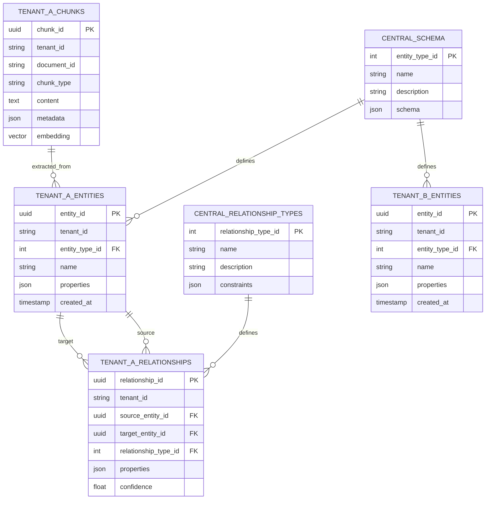

---

## Knowledge Graph Architecture

### Knowledge Graph Component Model

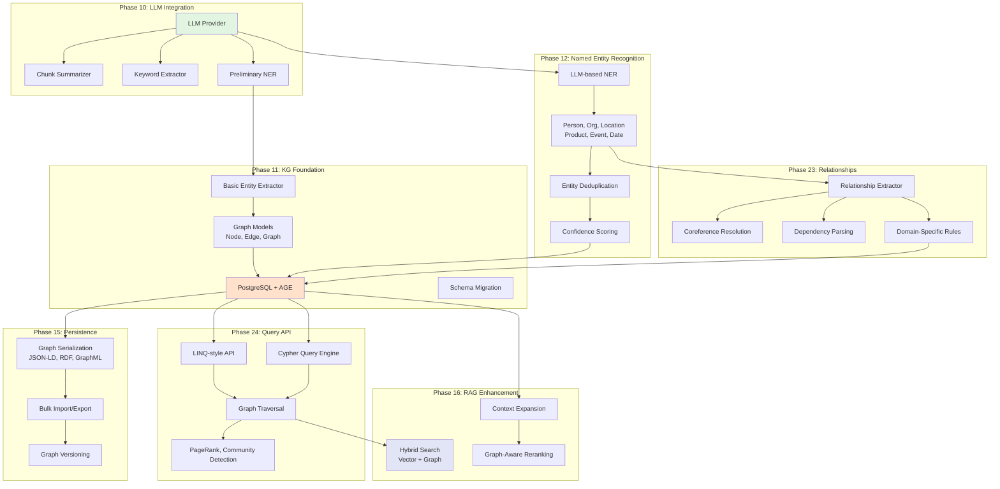

### Knowledge Graph Data Flow

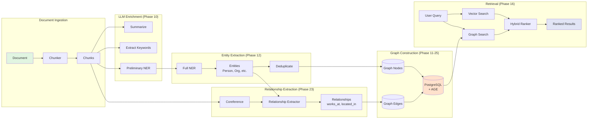

---

## Sequence Diagrams

### Use Case 1: Help Query
*"How do I view last February's report?"*

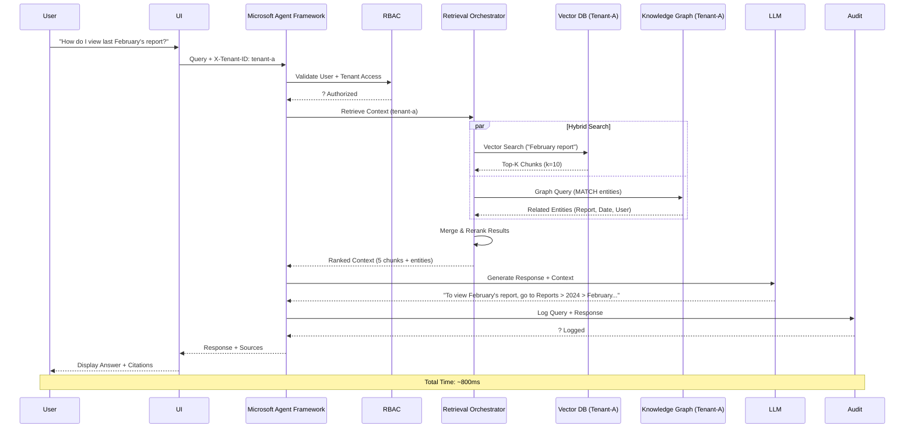

### Use Case 2: SQL Query Assistance
*"How many vulnerabilities over 7.0 were there last month?"*

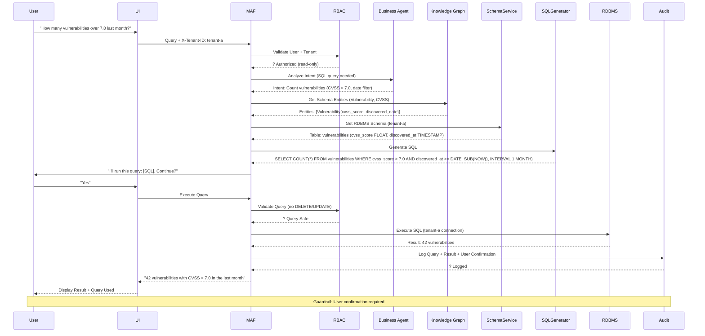

### Use Case 3: OData Query Assistance
*"Which customers are currently over 7.0 CVSS?"*

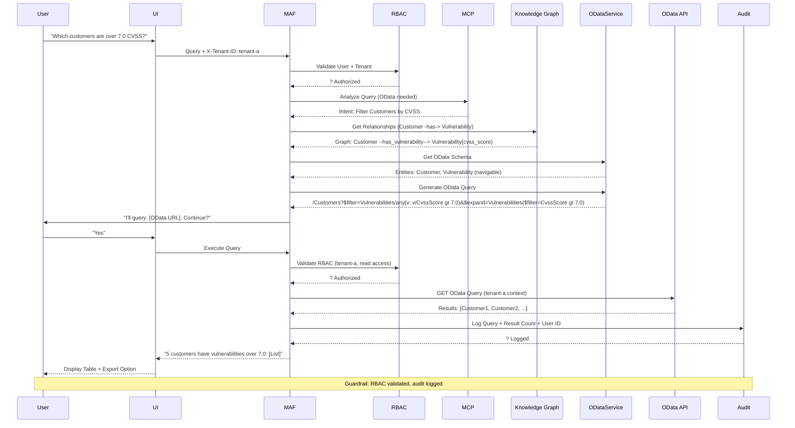

### Document Ingestion Flow (Cold Path)

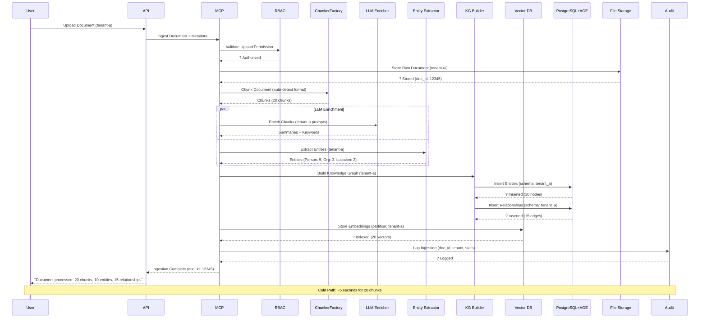

---

## Component Interaction Diagrams

### Phase 10-26 Integration Flow

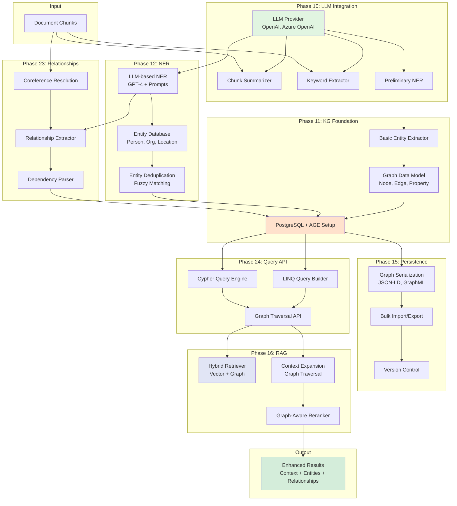

### RBAC + Audit Flow

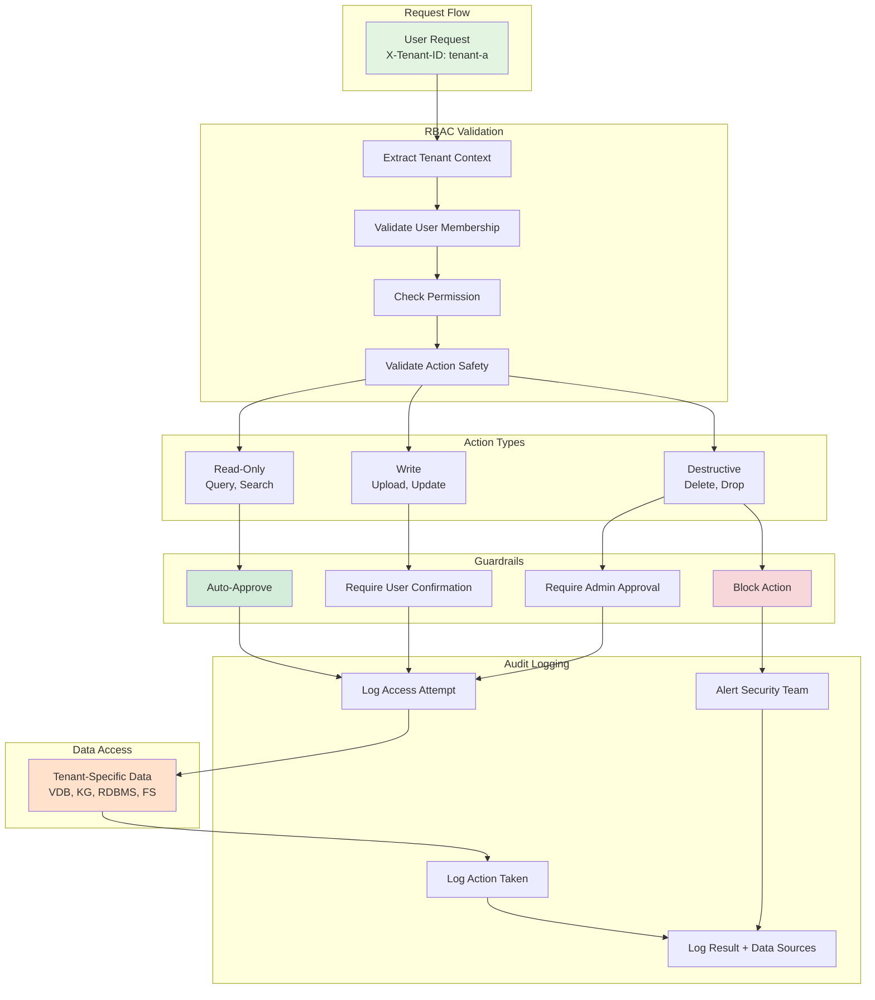

---

## Technology Stack Summary

### Phase Implementation Dependencies

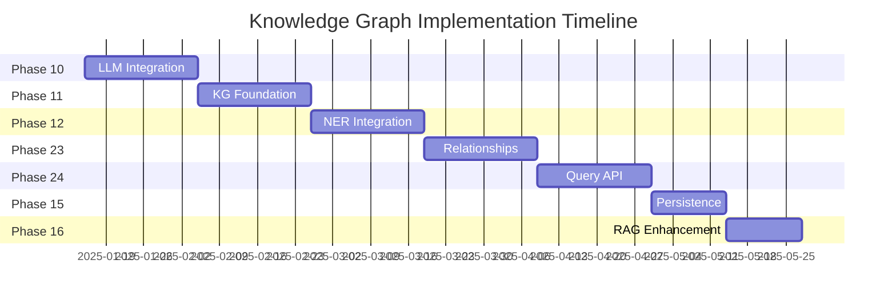

### Component Technology Mapping

| Component | Technology | Phase | Purpose |
|-----------|-----------|-------|---------|
| **LLM Provider** | OpenAI SDK, Azure.AI.OpenAI | 11 | Text generation, NER, summarization |
| **Vector Database** | Qdrant, Milvus, or Pinecone | 12 | Semantic search via embeddings |
| **Graph Database** | PostgreSQL + Apache AGE | 21 | Knowledge graph storage |
| **Message Queue** | RabbitMQ or Azure Service Bus | 13 | Async processing pipeline |
| **Cache Layer** | Redis | 13 | Response caching, rate limiting |
| **RBAC** | Custom + ASP.NET Core Identity | 19 | Multi-tenant authorization |
| **Audit Logging** | Serilog + Seq or Application Insights | 19 | Compliance logging |
| **MCP Server** | Microsoft.Extensions.AI + MCP SDK | 17 | Tool/resource protocol |
| **Agent Framework** | Semantic Kernel or AutoGen | 17 | Agent orchestration |

---

## Next Steps

### Documentation Tasks
1. ? Architecture diagrams created
2. ? Create detailed component specifications
3. ? Design API contracts (REST + MCP)
4. ? Create database schema migration scripts
5. ? Write security model documentation

### Implementation Tasks
1. ? Start Phase 10: LLM Integration
2. ? Set up PostgreSQL + AGE development environment
3. ? Design `TenantContext` infrastructure
4. ? Create multi-tenant test fixtures
5. ? Implement RBAC foundation

### Architecture Decision Records
1. ? ADR-001: Multi-Tenant Isolation Strategy (Schema vs RLS)
2. ? ADR-002: Vector Database Selection
3. ? ADR-003: LLM Provider Strategy (OpenAI vs Azure vs Local)
4. ? ADR-004: Graph Query Language (LINQ vs Cypher vs Both)
5. ? ADR-005: MCP vs Custom Protocol

---

**Document Version**: 1.0  
**Last Updated**: January 2025  
**Author**: PanoramicData Development Team  
**Status**: Draft - Ready for Phase 10 Implementation
