# PanoramicData.Chunker - Detailed Sequence Diagrams

## Table of Contents
1. [Document Processing Workflows](#document-processing-workflows)
2. [Query Processing Workflows](#query-processing-workflows)
3. [Knowledge Graph Construction](#knowledge-graph-construction)
4. [Multi-Tenant Operations](#multi-tenant-operations)
5. [Error Handling & Recovery](#error-handling--recovery)

---

## Document Processing Workflows

### 1. Document Upload & Chunking (Phase 1-9)

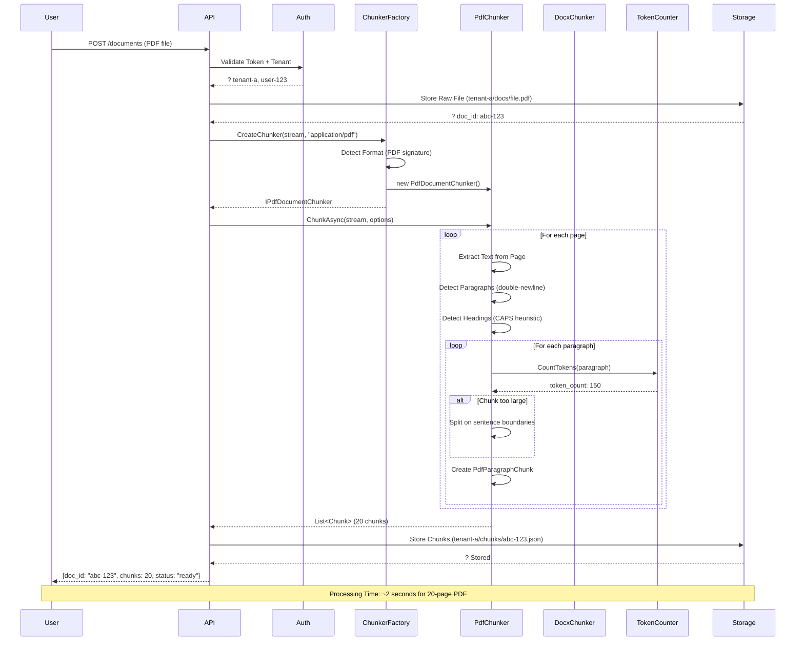

### 2. Document Enrichment with LLM (Phase 10)

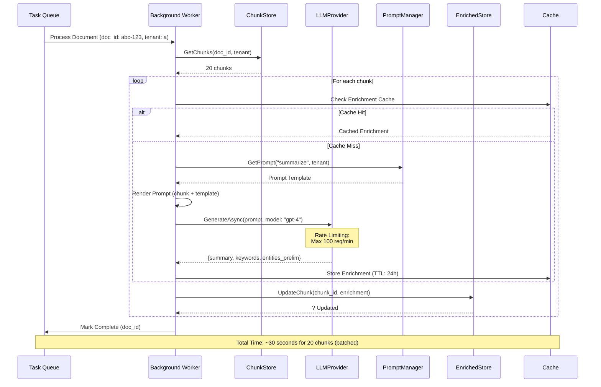

### 3. Knowledge Graph Construction (Phase 11-23)

```mermaid
sequenceDiagram
    participant Enriched as Enriched Chunks
    participant NER as Entity Extractor
    participant LLM
    participant Deduplicator
    participant RelExtractor
    participant Coref as Coreference Resolver
    participant GraphBuilder
  participant PostgreSQL
    
    Enriched->>NER: Extract Entities (chunk_1, tenant-a)
    
 NER->>LLM: Prompt: "Extract entities from: {text}"
    LLM-->>NER: {persons: ["John Smith"], orgs: ["Acme Corp"]}
    
  NER->>Deduplicator: Deduplicate("John Smith", tenant-a)
    
    Deduplicator->>PostgreSQL: SELECT * FROM tenant_a.entities WHERE name ILIKE '%John Smith%'
    PostgreSQL-->>Deduplicator: Existing: [{id: e-1, name: "John A. Smith"}]
    
    Deduplicator->>Deduplicator: Fuzzy Match (similarity: 0.92)
  
    alt High Similarity (>0.9)
        Deduplicator-->>NER: Use Existing: e-1
    else New Entity
        Deduplicator->>PostgreSQL: INSERT INTO tenant_a.entities
        PostgreSQL-->>Deduplicator: New ID: e-10
  Deduplicator-->>NER: New Entity: e-10
    end
    
    NER-->>Enriched: Entities: [e-1 (Person), e-2 (Org)]
    
    Enriched->>RelExtractor: Extract Relationships (chunk_1, entities)
    
    RelExtractor->>Coref: Resolve References (chunk_1)
    Coref-->>RelExtractor: Coreference Chains: [["John", "he"], ["Acme", "company"]]
    
    RelExtractor->>LLM: Prompt: "What is the relationship between {e-1} and {e-2}?"
    LLM-->>RelExtractor: {type: "works_at", confidence: 0.85, properties: {role: "CEO"}}
    
    RelExtractor->>GraphBuilder: AddRelationship(e-1, e-2, "works_at", tenant-a)
    
    GraphBuilder->>PostgreSQL: SELECT * FROM ag_catalog.ag_graph WHERE graph_name = 'tenant_a'
    
    alt Graph Exists
     GraphBuilder->>PostgreSQL: SELECT * FROM cypher('tenant_a', $$ MATCH (n {id: $e_1}) RETURN n $$)
    else Graph Not Exists
   GraphBuilder->>PostgreSQL: SELECT create_graph('tenant_a')
    end
    
    GraphBuilder->>PostgreSQL: SELECT * FROM cypher('tenant_a', $$<br/>MERGE (p:Person {id: $e_1})<br/>MERGE (o:Organization {id: $e_2})<br/>MERGE (p)-[r:WORKS_AT {confidence: $conf}]->(o)<br/>RETURN r<br/>$$) AS (relationship agtype)
    
    PostgreSQL-->>GraphBuilder: ? Relationship Created
    
    GraphBuilder-->>RelExtractor: ? Added to Graph
    
    Note over Enriched,PostgreSQL: Graph Construction: ~5 seconds per document
```

---

## Query Processing Workflows

### 4. Hybrid Search (Vector + Graph) - Phase 16

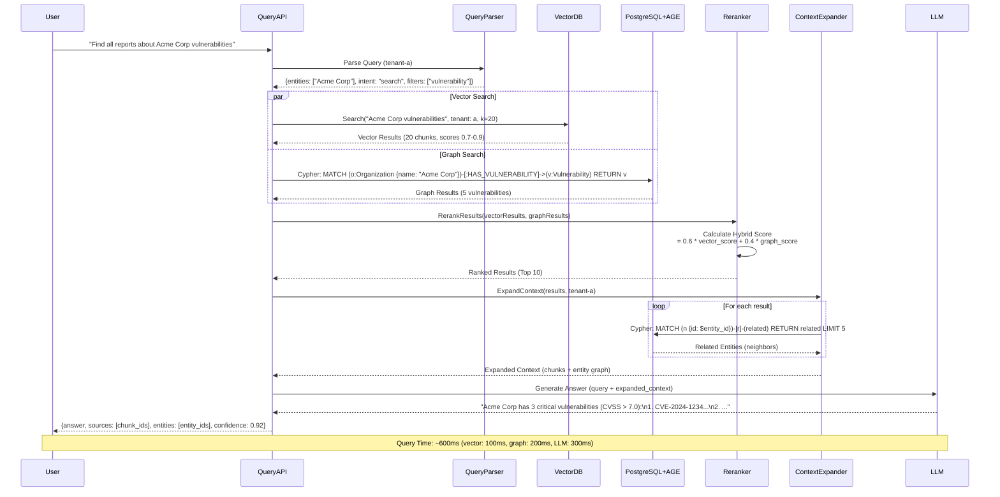

### 5. SQL Query Generation from Natural Language

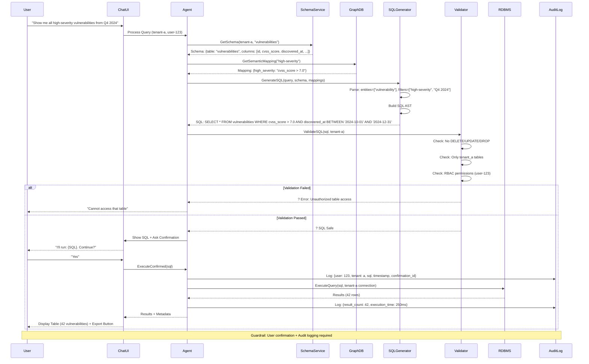

### 6. Cross-Document Entity Resolution

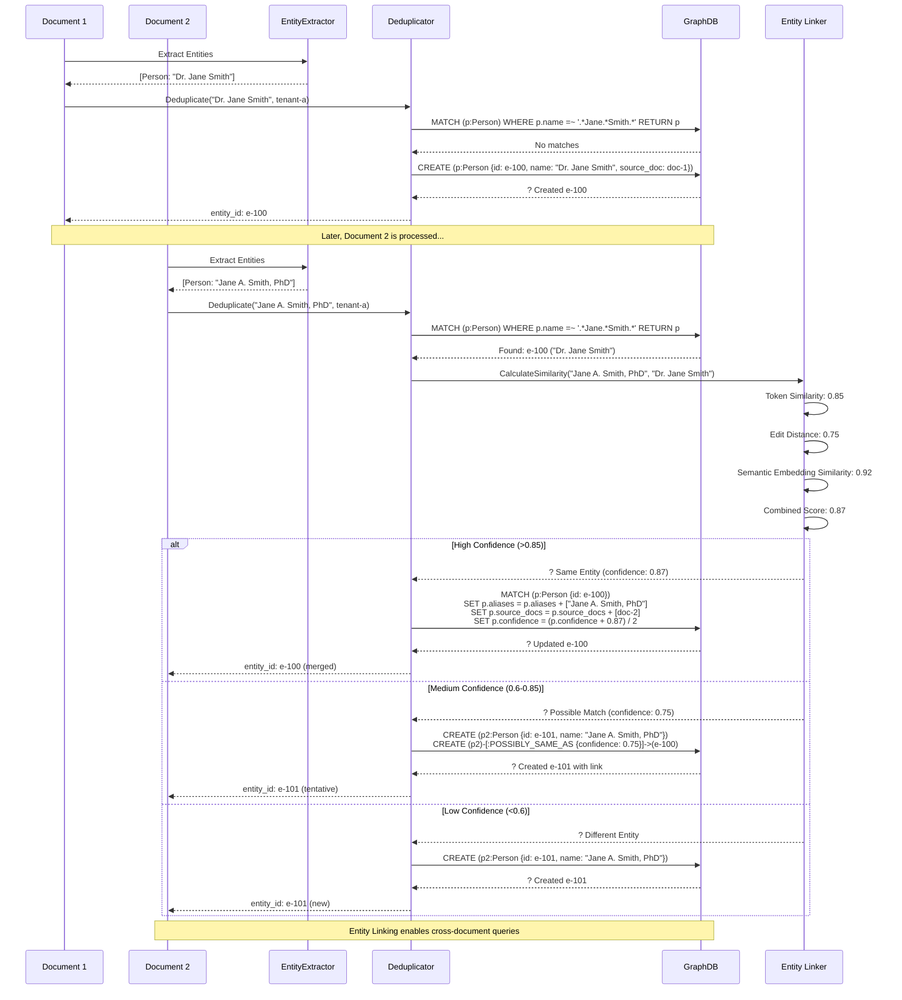

---

## Multi-Tenant Operations

### 7. Tenant Provisioning

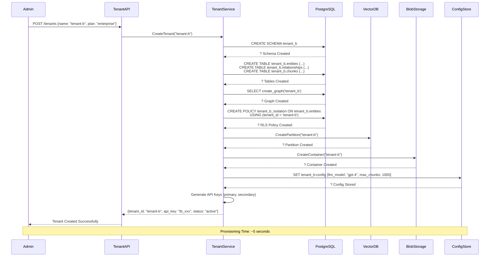

### 8. Tenant Isolation Validation

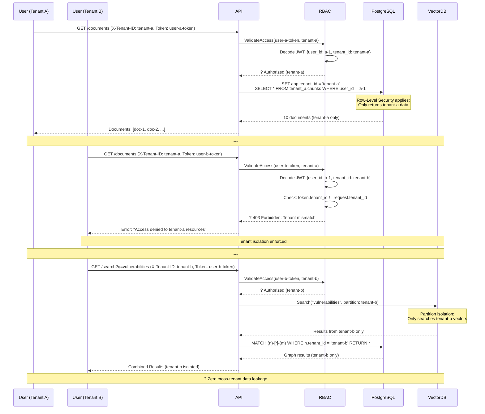

---

## Error Handling & Recovery

### 9. LLM Rate Limit & Retry Logic

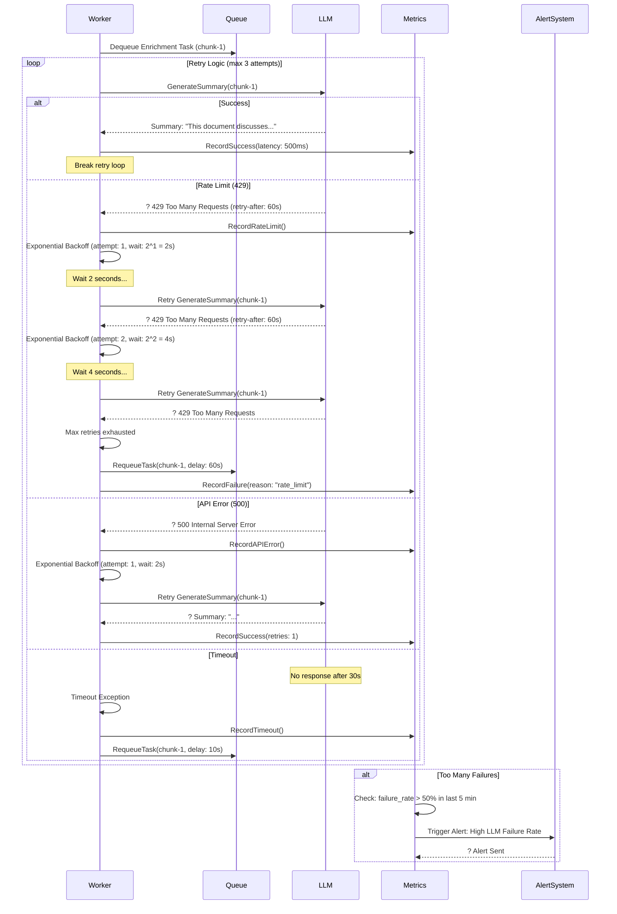

### 10. Knowledge Graph Consistency Check

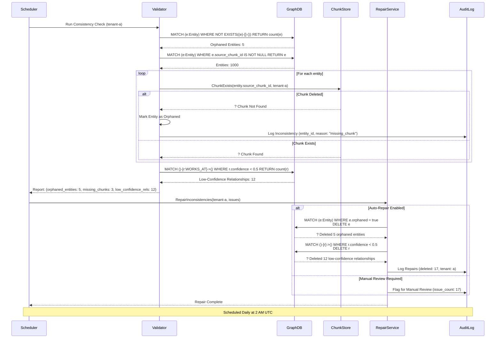

---

## Performance Optimization Workflows

### 11. Caching Strategy (Phase 13)

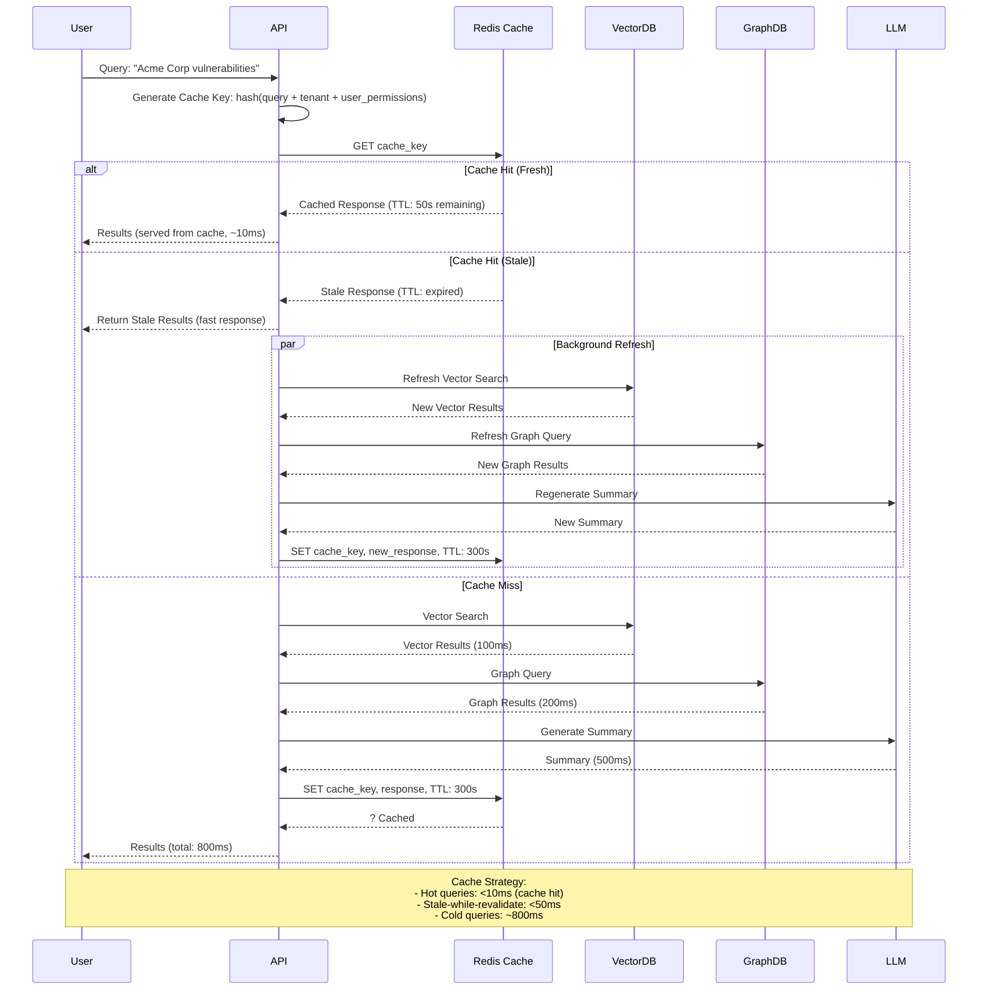

### 12. Batch Processing Pipeline

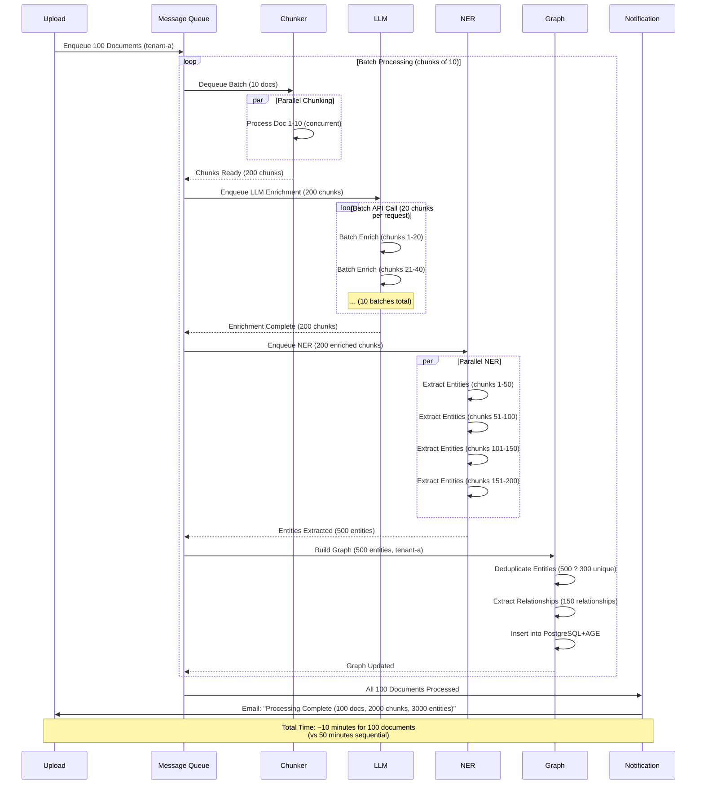

---

## Security & Compliance

### 13. Data Export for GDPR Compliance

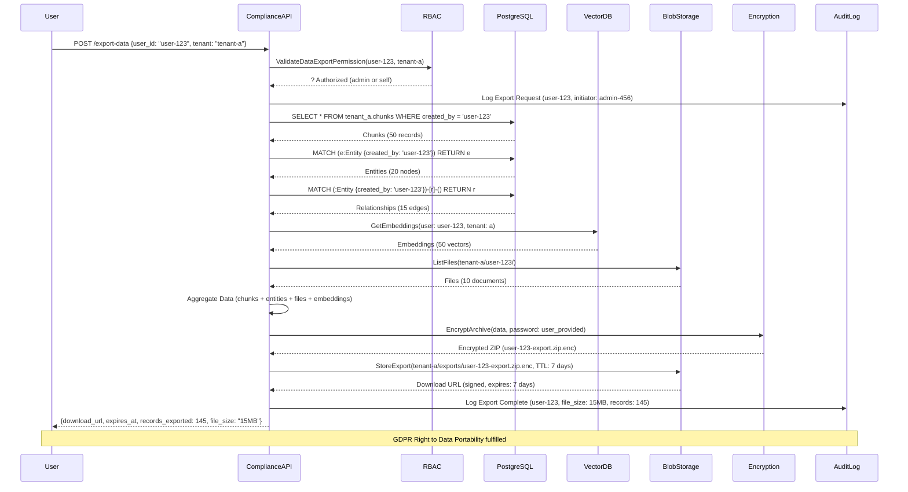

---

**Document Version**: 1.0  
**Last Updated**: January 2025  
**Related Documents**: 
- [Architecture Diagrams](ARCHITECTURE_DIAGRAMS.md)
- [Phase 10 Specification](../phases/Phase-11.md)
- [Phase 11-26 Specifications](../phases/)
